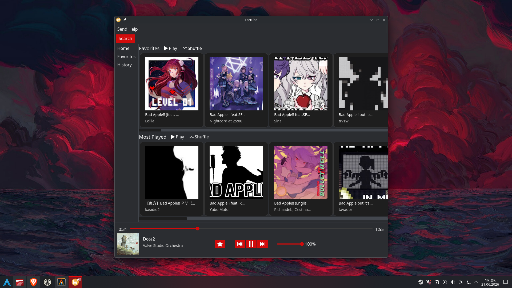

# Eartube

A stupid simple YouTube Music frontend with caching (only Favorites) and stuff.



## Installation

This software depends on the `yt-dlp` being on the `PATH`. No other additional dependensies needed.

```sh
cargo install --path .
```

## Icon Credits
https://www.svgrepo.com/

Vectors and icons by <a href="https://www.bypeople.com/minimal-free-pixel-perfect-icons/?ref=svgrepo.com" target="_blank">Bypeople</a> in PD License via <a href="https://www.svgrepo.com/" target="_blank">SVG Repo</a>

Vectors and icons by <a href="https://github.com/UXAspects/UXAspects?ref=svgrepo.com" target="_blank">Uxaspects</a> in Apache License via <a href="https://www.svgrepo.com/" target="_blank">SVG Repo</a>

Vectors and icons by <a href="https://github.com/prmack/16pxls?ref=svgrepo.com" target="_blank">Prmack</a> in CC Attribution License via <a href="https://www.svgrepo.com/" target="_blank">SVG Repo</a>

Vectors and icons by <a href="https://brankic1979.com/?ref=svgrepo.com" target="_blank">Brankic1979</a> in PD License via <a href="https://www.svgrepo.com/" target="_blank">SVG Repo</a>

Vectors and icons by <a href="https://github.com/carbon-design-system/carbon?ref=svgrepo.com" target="_blank">Carbon Design</a> in Apache License via <a href="https://www.svgrepo.com/" target="_blank">SVG Repo</a>

## Stuff left to do

- Fix streaming (This is a limitation on the `rodio`/`symphonia` side. For now, I will wait for a fix.)
- Playlists
- Better search
- Better error handling
